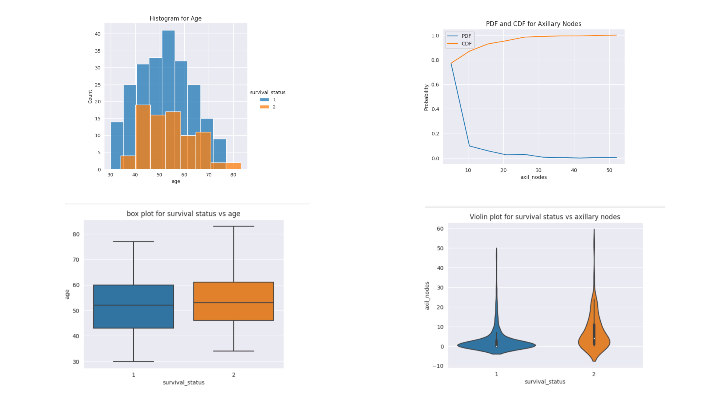

# 🧬 Cancer Survival Analysis & Predictive Insights (Python)

## 📌 Project Overview
This project performs Exploratory Data Analysis (EDA) on the Haberman’s Cancer Survival Dataset using Python.  
The objective is to analyze survival patterns of cancer patients and identify the most influential factors affecting survival outcomes.

Using Python libraries such as NumPy, Pandas, Matplotlib, and Seaborn, the dataset was explored through statistical analysis and visualizations to uncover meaningful medical insights.

---

## 🧩 Business Problem
Understanding the factors affecting cancer patient survival is essential for healthcare analysis and predictive decision-making.  
Raw medical data often lacks clear interpretation, making it difficult to identify patterns associated with patient survival.

---

## 🎯 Goal
To perform Exploratory Data Analysis (EDA) and identify the most useful feature influencing cancer survival status.

---

## 📊 Dataset Information

The dataset contains information about patients who underwent surgery for breast cancer.

### 📑 Features

| Column Name | Description |
|------------|------------|
| Age | Age of patient at operation |
| Operation Year | Year of operation |
| Axillary Nodes | Number of positive axillary nodes detected |
| Survival Status | Patient survival status |

### 🎯 Survival Status
- **1** → Patient survived 5 years or longer  
- **2** → Patient died within 5 years  

---

## 🧹 Exploratory Data Analysis (EDA)

### 📌 Univariate Analysis
- Histograms  
- PDFs (Probability Density Functions)  
- CDFs (Cumulative Distribution Functions)  
- Box Plots  
- Violin Plots  

### 📌 Bivariate Analysis
- Scatter Plots  
- Pair Plots  

### 📌 Statistical Analysis
- Mean  
- Median  
- Standard Deviation  
- Percentiles  

### 📌 EDA Visualizations

---

## 📊 Key Findings

- **Axillary Nodes** is the most important feature influencing survival status  
- Patients with fewer axillary nodes had significantly higher survival chances  
- Most patients were between the age group of 40–60 years  
- Age alone was not a strong indicator of survival  
- Higher axillary node count was associated with lower survival probability  

---

## 💼 Business Impact

- Helps understand survival-related medical patterns  
- Supports healthcare data analysis and research  
- Demonstrates practical application of Exploratory Data Analysis  
- Provides foundation for future predictive modeling projects  

---

## 🛠 Tools & Libraries Used

- Python  
- Jupyter Notebook  
- NumPy  
- Pandas  
- Matplotlib  
- Seaborn  

---

## 📂 Repository Structure
```bash
cancer-survival-analysis-python/
│
├── dataset/
│   └── haberman.csv
│
├── python notebook/
│   └── Python Project EDA on Habermans Survival Dataset.ipynb
│
├── images/
│   └── eda_visualizations.png
│
├── README.md
└── .gitignore
```

---

## 🛡️ License

This project is licensed under the [MIT License](LICENSE). You are free to use, modify, and share this project with proper attribution.

## 🌟 About Me

Hi there! I'm **Sumit Sutar**. An experienced Data Analyst who uncovers hidden trends, patterns and anomalies and leverages business intelligence to generate insights, improve operational efficiency and drive organizational growth.


Let's stay in touch! Feel free to connect with me on the following platforms:

[](https://www.linkedin.com/in/sumitsutar2507)
